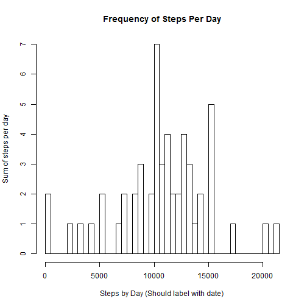
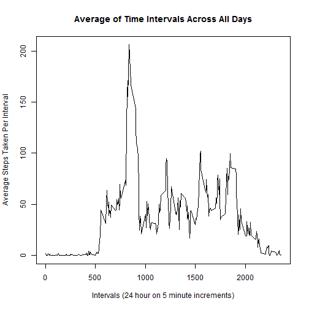
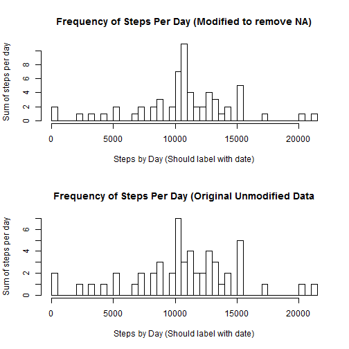
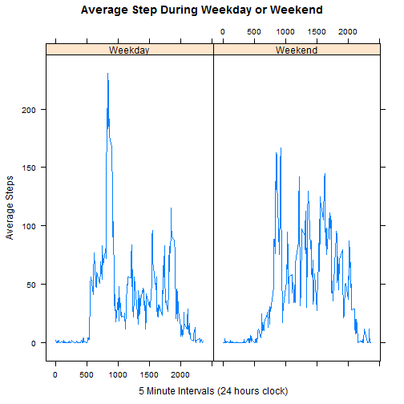

## Loading and preprocessing the data
Use the data.table to import and query against the dataset

```r
library(data.table)

library(lubridate)

act <- read.table(file="activity.csv", header=T, sep=",", row.names=NULL, stringsAsFactors=F)

## convert the date to actual date type
act$date <- ymd(act$date)

attach(act)
```

```
## The following objects are masked from act (pos = 3):
## 
##     date, interval, steps
## 
## The following objects are masked from act (pos = 5):
## 
##     date, interval, steps
## 
## The following objects are masked from act (pos = 8):
## 
##     date, interval, steps
```

## What is mean total number of steps taken per day?

```r
library(dplyr)

stepsPerDay <- act %>% filter(complete.cases(act)) %>% select(date, steps) %>% group_by(date) %>% summarize(dailyCount = sum(steps))
print("Confirm sum of data")
```

```
## [1] "Confirm sum of data"
```

```r
head(stepsPerDay)
```

```
## Source: local data frame [6 x 2]
## 
##         date dailyCount
## 1 2012-10-02        126
## 2 2012-10-03      11352
## 3 2012-10-04      12116
## 4 2012-10-05      13294
## 5 2012-10-06      15420
## 6 2012-10-07      11015
```

```r
par(mfrow=c(1,1))
hist(stepsPerDay$dailyCount, breaks=35, xlab="Steps by Day (Should label with date)", ylab="Sum of steps per day", main="Frequency of Steps Per Day")
```

 

Mean of steps taken per day: 

```r
print(mean(stepsPerDay$dailyCount))
```

```
## [1] 10766.19
```

Media of steps taken per day:

```r
print(median(stepsPerDay$dailyCount))
```

```
## [1] 10765
```


## What is the average daily activity pattern?


```r
averStepsPerInterval <- act %>% filter(complete.cases(act)) %>% select(interval, steps) %>% group_by(interval) %>% summarize(avgSteps = mean(steps))

print("Confirm group and avg of data")
```

```
## [1] "Confirm group and avg of data"
```

```r
head(averStepsPerInterval)
```

```
## Source: local data frame [6 x 2]
## 
##   interval  avgSteps
## 1        0 1.7169811
## 2        5 0.3396226
## 3       10 0.1320755
## 4       15 0.1509434
## 5       20 0.0754717
## 6       25 2.0943396
```

```r
plot(x=averStepsPerInterval$interval, y=averStepsPerInterval$avgSteps, type="l", xlab="Intervals (24 hour on 5 minute increments)", ylab="Average Steps Taken Per Interval", main="Average of Time Intervals Across All Days")
```

 

Which 5 minute increment contains the maximum number of steps:

```r
averStepsPerInterval[max(averStepsPerInterval$avgSteps), ]
```

```
## Source: local data frame [1 x 2]
## 
##   interval avgSteps
## 1     1705 56.30189
```
Roughly around 5PM at night.  This probably correlates with leaving work and coming home.


## Imputing missing values

```r
misValues <- act %>% filter(!complete.cases(act))
head(misValues)
```

```
##   steps       date interval
## 1    NA 2012-10-01        0
## 2    NA 2012-10-01        5
## 3    NA 2012-10-01       10
## 4    NA 2012-10-01       15
## 5    NA 2012-10-01       20
## 6    NA 2012-10-01       25
```

```r
summary(misValues)
```

```
##      steps           date                        interval     
##  Min.   : NA    Min.   :2012-10-01 00:00:00   Min.   :   0.0  
##  1st Qu.: NA    1st Qu.:2012-10-26 00:00:00   1st Qu.: 588.8  
##  Median : NA    Median :2012-11-06 12:00:00   Median :1177.5  
##  Mean   :NaN    Mean   :2012-11-01 21:00:00   Mean   :1177.5  
##  3rd Qu.: NA    3rd Qu.:2012-11-11 00:00:00   3rd Qu.:1766.2  
##  Max.   : NA    Max.   :2012-11-30 00:00:00   Max.   :2355.0  
##  NA's   :2304
```

```r
length(misValues[is.na(misValues$steps),1])
```

```
## [1] 2304
```
Total number of missing steps is 2304

Replace NA values with the average for the given interval period


```r
newStepCount <- merge(act, averStepsPerInterval, by="interval")
newStepCount <- newStepCount %>% mutate(steps= ifelse(is.na(steps), avgSteps, steps))

#Confirm that all NA's have been removed.
sum(!complete.cases(newStepCount))
```

```
## [1] 0
```

```r
newStepsPerDay <- newStepCount %>% select(date, steps) %>% group_by(date) %>% summarize(dailyCount = sum(steps))
print("Confirm sum of data")
```

```
## [1] "Confirm sum of data"
```

```r
head(newStepsPerDay)
```

```
## Source: local data frame [6 x 2]
## 
##         date dailyCount
## 1 2012-10-01   10766.19
## 2 2012-10-02     126.00
## 3 2012-10-03   11352.00
## 4 2012-10-04   12116.00
## 5 2012-10-05   13294.00
## 6 2012-10-06   15420.00
```

```r
summary(newStepCount)
```

```
##     interval          steps             date               avgSteps      
##  Min.   :   0.0   Min.   :  0.00   Min.   :2012-10-01   Min.   :  0.000  
##  1st Qu.: 588.8   1st Qu.:  0.00   1st Qu.:2012-10-16   1st Qu.:  2.486  
##  Median :1177.5   Median :  0.00   Median :2012-10-31   Median : 34.113  
##  Mean   :1177.5   Mean   : 37.38   Mean   :2012-10-31   Mean   : 37.383  
##  3rd Qu.:1766.2   3rd Qu.: 27.00   3rd Qu.:2012-11-15   3rd Qu.: 52.835  
##  Max.   :2355.0   Max.   :806.00   Max.   :2012-11-30   Max.   :206.170
```

```r
par(mfrow=c(2,1))
hist(newStepsPerDay$dailyCount, breaks=35, xlab="Steps by Day (Should label with date)", ylab="Sum of steps per day", main="Frequency of Steps Per Day (Modified to remove NA)")

hist(stepsPerDay$dailyCount, breaks=35, xlab="Steps by Day (Should label with date)", ylab="Sum of steps per day", main="Frequency of Steps Per Day (Original Unmodified Data")
```

 

Mean of steps taken per day (NA replaced with interval mean): 

```r
print(mean(newStepsPerDay$dailyCount))
```

```
## [1] 10766.19
```

Media of steps taken per day (NA replaced with interval mean):

```r
print(median(newStepsPerDay$dailyCount))
```

```
## [1] 10766.19
```

```

The mean and median values between the original data and the modified data are about the same.  If you look at the actual histograms you can see a bit of shifting.  Some values are higher and some values are lower.  This did not make much of a difference in the mean values even though we can seem some shifting in the histogram.

## Are there differences in activity patterns between weekdays and weekends?


```r
library(lattice)

newStepCountWeekdays <- newStepCount %>% select(steps, date, interval, avgSteps) %>% mutate(Weekday=factor(ifelse(weekdays(date) %in% c("Saturday", "Sunday"), "Weekend", "Weekday"))) 
head(newStepCountWeekdays)
```

```
##      steps       date interval avgSteps Weekday
## 1 1.716981 2012-10-01        0 1.716981 Weekday
## 2 0.000000 2012-11-23        0 1.716981 Weekday
## 3 0.000000 2012-10-28        0 1.716981 Weekend
## 4 0.000000 2012-11-06        0 1.716981 Weekday
## 5 0.000000 2012-11-24        0 1.716981 Weekend
## 6 0.000000 2012-11-15        0 1.716981 Weekday
```

```r
summary(newStepCountWeekdays)
```

```
##      steps             date               interval         avgSteps      
##  Min.   :  0.00   Min.   :2012-10-01   Min.   :   0.0   Min.   :  0.000  
##  1st Qu.:  0.00   1st Qu.:2012-10-16   1st Qu.: 588.8   1st Qu.:  2.486  
##  Median :  0.00   Median :2012-10-31   Median :1177.5   Median : 34.113  
##  Mean   : 37.38   Mean   :2012-10-31   Mean   :1177.5   Mean   : 37.383  
##  3rd Qu.: 27.00   3rd Qu.:2012-11-15   3rd Qu.:1766.2   3rd Qu.: 52.835  
##  Max.   :806.00   Max.   :2012-11-30   Max.   :2355.0   Max.   :206.170  
##     Weekday     
##  Weekday:12960  
##  Weekend: 4608  
##                 
##                 
##                 
## 
```

```r
newStepsPerWeekday <- newStepCountWeekdays %>% select(interval, steps, Weekday) %>% group_by(Weekday, interval) %>% summarize(avg = mean(steps))
print("Confirm sum of data")
```

```
## [1] "Confirm sum of data"
```

```r
head(newStepsPerWeekday)
```

```
## Source: local data frame [6 x 3]
## Groups: Weekday
## 
##   Weekday interval        avg
## 1 Weekday        0 2.25115304
## 2 Weekday        5 0.44528302
## 3 Weekday       10 0.17316562
## 4 Weekday       15 0.19790356
## 5 Weekday       20 0.09895178
## 6 Weekday       25 1.59035639
```

```r
summary(newStepsPerWeekday)
```

```
##     Weekday       interval           avg         
##  Weekday:288   Min.   :   0.0   Min.   :  0.000  
##  Weekend:288   1st Qu.: 588.8   1st Qu.:  2.047  
##                Median :1177.5   Median : 28.133  
##                Mean   :1177.5   Mean   : 38.988  
##                3rd Qu.:1766.2   3rd Qu.: 61.263  
##                Max.   :2355.0   Max.   :230.378
```

```r
xyplot( avg ~ interval | Weekday, data=newStepsPerWeekday, type="l", main="Average Step During Weekday or Weekend", ylab="Average Steps", xlab="5 Minute Intervals (24 hours clock)")
```

 


```r
require(knitr)

knit2html("PA1_template.Rmd")
```

```
## 
## 
## processing file: PA1_template.Rmd
```

```
## 
  |                                                                       
  |                                                                 |   0%
  |                                                                       
  |...                                                              |   4%
##   ordinary text without R code
## 
## 
  |                                                                       
  |.....                                                            |   8%
## label: unnamed-chunk-13 (with options) 
## List of 1
##  $ cache: symbol F
## 
## 
  |                                                                       
  |........                                                         |  12%
##   ordinary text without R code
## 
## 
  |                                                                       
  |...........                                                      |  17%
## label: unnamed-chunk-14
```

```
## 
  |                                                                       
  |..............                                                   |  21%
##   ordinary text without R code
## 
## 
  |                                                                       
  |................                                                 |  25%
## label: unnamed-chunk-15
## 
  |                                                                       
  |...................                                              |  29%
##   ordinary text without R code
## 
## 
  |                                                                       
  |......................                                           |  33%
## label: unnamed-chunk-16
## 
  |                                                                       
  |........................                                         |  38%
##   ordinary text without R code
## 
## 
  |                                                                       
  |...........................                                      |  42%
## label: unnamed-chunk-17
```

```
## 
  |                                                                       
  |..............................                                   |  46%
##   ordinary text without R code
## 
## 
  |                                                                       
  |................................                                 |  50%
## label: unnamed-chunk-18
## 
  |                                                                       
  |...................................                              |  54%
##   ordinary text without R code
## 
## 
  |                                                                       
  |......................................                           |  58%
## label: unnamed-chunk-19
## 
  |                                                                       
  |.........................................                        |  62%
##    inline R code fragments
## 
## 
  |                                                                       
  |...........................................                      |  67%
## label: unnamed-chunk-20
```

```
## 
  |                                                                       
  |..............................................                   |  71%
##   ordinary text without R code
## 
## 
  |                                                                       
  |.................................................                |  75%
## label: unnamed-chunk-21
## 
  |                                                                       
  |...................................................              |  79%
##   ordinary text without R code
## 
## 
  |                                                                       
  |......................................................           |  83%
## label: unnamed-chunk-22
## 
  |                                                                       
  |.........................................................        |  88%
##   ordinary text without R code
## 
## 
  |                                                                       
  |............................................................     |  92%
## label: unnamed-chunk-23
```

```
## 
  |                                                                       
  |..............................................................   |  96%
##   ordinary text without R code
## 
## 
  |                                                                       
  |.................................................................| 100%
## label: unnamed-chunk-24
```

```
## output file: PA1_template.md
```

```r
if(interactive()) browseURL("PA1_template.html")
```

 
